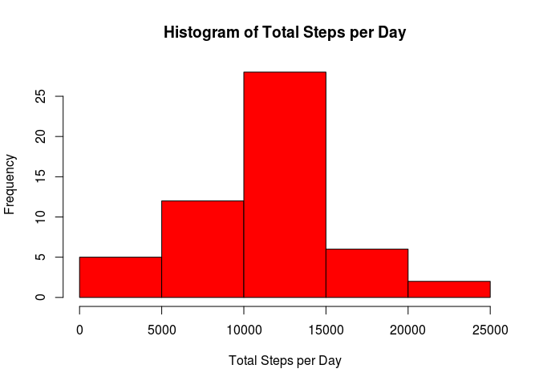
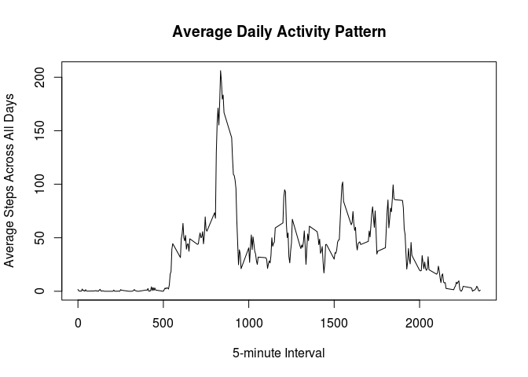
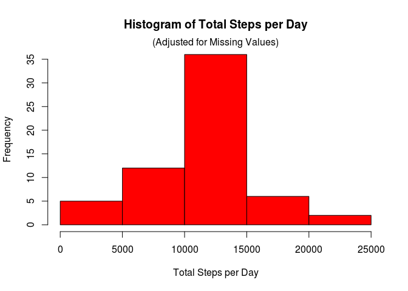
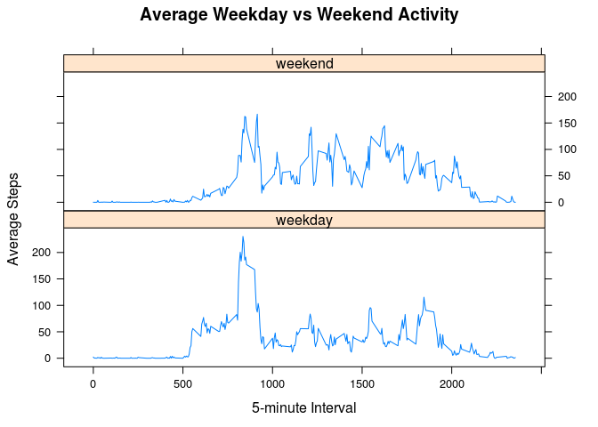

# Reproducible Research: Peer Assessment 1


## Loading and preprocessing the data


```r
activity_data <- read.csv("activity.csv")
```

## What is mean total number of steps taken per day?


```r
steps_per_day <- aggregate(steps ~ date, activity_data, sum)
hist(steps_per_day$steps, col = "Red",
     main = "Histogram of Total Steps per Day",
     xlab = "Total Steps per Day")
```

 

```r
mean(steps_per_day$steps)
```

```
## [1] 10766.19
```

```r
median(steps_per_day$steps)
```

```
## [1] 10765
```

## What is the average daily activity pattern?


```r
steps_per_int <- aggregate(steps ~ interval, activity_data, mean)
plot(steps_per_int$interval, steps_per_int$steps, type = "l",
     main = "Average Daily Activity Pattern",
     xlab = "5-minute Interval",
     ylab = "Average Steps Across All Days")
```

 

```r
subset(steps_per_int, steps == max(steps))
```

```
##     interval    steps
## 104      835 206.1698
```

## Imputing missing values


```r
sum(is.na(activity_data))
```

```
## [1] 2304
```

Adjust missing values by replacing with mean values by interval across all days.

```r
activity_data$mean <- steps_per_int$steps
activity_data$steps[is.na(activity_data$steps)] <- 
    activity_data$mean[is.na(activity_data$steps)]
```

Repeat steps above with adjusted activity data.

```r
steps_per_day <- aggregate(steps ~ date, activity_data, sum)
hist(steps_per_day$steps, col = "Red",
     main = "Histogram of Total Steps per Day",
     xlab = "Total Steps per Day")
mtext("(Adjusted for Missing Values)")
```

 

```r
mean(steps_per_day$steps)
```

```
## [1] 10766.19
```

```r
median(steps_per_day$steps)
```

```
## [1] 10766.19
```
Comparing adjusted activity data to the original with missing values, the *mean* remained the same and the *median* became slightly larger.

## Are there differences in activity patterns between weekdays and weekends?


```r
activity_data$weektype <- factor(
    grepl("Sat|Sun", weekdays(as.Date(activity_data$date))),
    labels = c("weekday", "weekend"))

steps_per_type <- with(activity_data, 
    aggregate(steps, list(interval=interval, weektype=weektype), mean))

library(lattice)
xyplot(
    steps_per_type$x ~ steps_per_type$interval | steps_per_type$weektype,
    type = "l", layout = c(1,2),
    main = "Average Weekday vs Weekend Activity",
    xlab = "5-minute Interval",
    ylab = "Average Steps")
```

 
