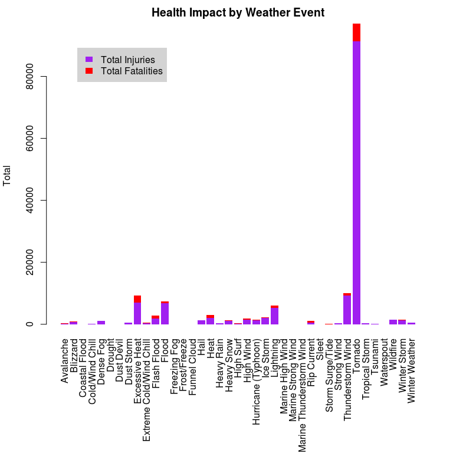
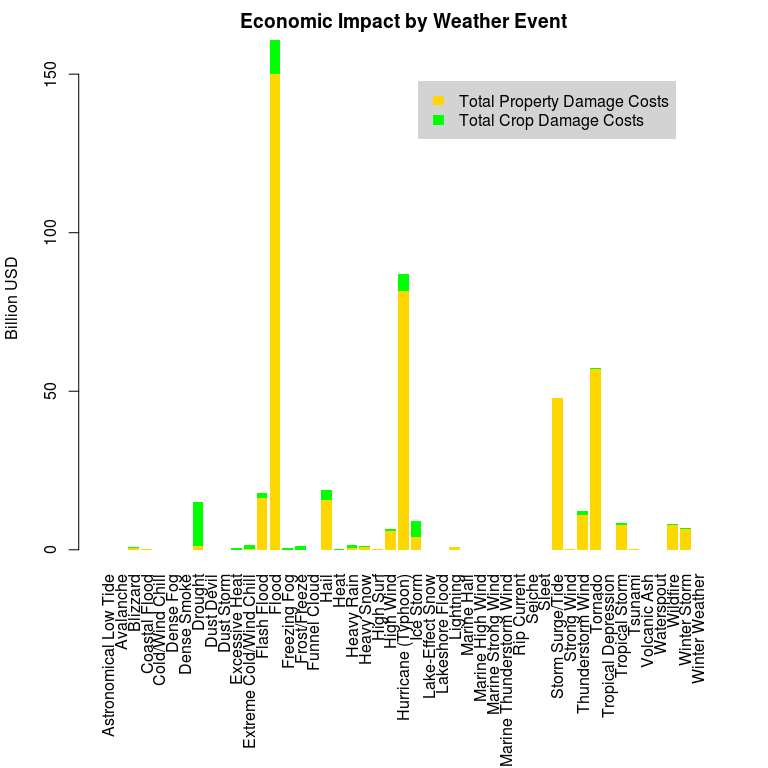

# Health and Economic Consequences of Storm Events Across the United States (1950-2011)

# Synopsis

The purpose of this report is to analyze the health and economic consequences of storm events across the United States.  The data used in the analysis comes from the NOAA storm database and contains observations from 1950-2011.  Due to changes in record keeping over the years, this data needs to be processed to allow for comparisons to be made.

Through analysis of the data, it is shown that *tornadoes* have caused the most harm causing over *5600* fatalities and *91000* injuries.

It is also shown that *floods* have caused the greatest economic consequences amassing costs of almost *$150* billion dollars in property damage and *$10.7* billion dollars in crop damage. *Droughts* rank higher in crop damage, costing over *$13.9* billion dollars.

# Data Processing

## Reading Data

First we must download the data, uncompress it and load it into our data frame for analysis.


```r
download.file(
    "https://d396qusza40orc.cloudfront.net/repdata%2Fdata%2FStormData.csv.bz2",
    destfile = "StormData.csv.bz2")
storm_data <- read.csv("StormData.csv.bz2")
```

## Processing Event Type Categories

We are interested in types of events which are stored in the `EVTYPE` field however to make comparisons with this field we need to clean the data.  To achieve this we attempt to coerce the data into one of the 48 "permitted storm data event" types described in Section 2 of the [NATIONAL WEATHER SERVICE INSTRUCTION 10-1605](https://d396qusza40orc.cloudfront.net/repdata%2Fpeer2_doc%2Fpd01016005curr.pdf).

Events that had fewer than 10 occurrences or otherwise cannot be categorized are ignored.


```r
storm_data <- storm_data[!table(storm_data$EVTYPE)[storm_data$EVTYPE] < 10,]
ev <- toupper(storm_data$EVTYPE) # Capitilize everything
evmap <- read.csv(stringsAsFactors = FALSE,
    text = '"PATTERN","EVENT"
"ASTRONOMICAL LOW TIDE","Astronomical Low Tide"
"AVALANCHE","Avalanche"
"BLIZZARD","Blizzard"
"ASTRONOMICAL HIGH TIDE|COASTAL FLOOD|COASTAL FLOODING","Coastal Flood"
"^COLD|^COLD/ WIND CHILL","Cold/Wind Chill"
"DEBRIS FLOW","Debris Flow"
"DENSE FOG|^FOG","Dense Fog"
"SMOKE","Dense Smoke"
"DROUGHT$","Drought"
"DUST DEVIL","Dust Devil"
"DUST STORM","Dust Storm"
"^EXCESSIVE HEAT|EXTREME HEAT|HEAT WAVE|RECORD HEAT|RECORD WARMTH","Excessive Heat"
"EXTREME COLD|EXTREME WINDCHILL|RECORD COLD","Extreme Cold/Wind Chill"
"^FLASH FLOODS*$|^FLASH FLOODING$","Flash Flood"
"^FLOOD$|^FLOODING$|RIVER FLOOD|TIDAL FLOOD|URBAN.*FL","Flood"
"FROST","Frost/Freeze"
"FUNNEL","Funnel Cloud"
"^FREEZE|FREEZING DRIZZLE|FREEZING FOG","Freezing Fog"
"^HAIL|SMALL HAIL","Hail"
"^HEAT$","Heat"
"HEAVY RAIN|^RAIN$|RECORD RAINFALL","Heavy Rain"
"EXCESSIVE SNOW|HEAVY SNOW|^SNOW","Heavy Snow"
"SURF","High Surf"
"GUSTY WIND|HIGH WIND|^WIND","High Wind"
"HURRICANE|TYPHOON","Hurricane (Typhoon)"
"ICE","Ice Storm"
"LAKE.*SNOW","Lake-Effect Snow"
"LAKESHORE FLOOD","Lakeshore Flood"
"LIGHTNING","Lightning"
"MARINE HAIL","Marine Hail"
"MARINE HIGH WIND","Marine High Wind"
"MARINE STRONG WIND","Marine Strong Wind"
"MARINE T.*M WIND","Marine Thunderstorm Wind"
"RIP CURRENT","Rip Current"
"SEICHE","Seiche"
"SLEET","Sleet"
"STORM SURGE","Storm Surge/Tide"
"^STRONG WIND","Strong Wind"
"SEVERE|^THUNDERSTORM$|^T.*WINDS*$|\\(G4","Thunderstorm Wind"
"TORNADO","Tornado"
"TROPICAL DEPRESSION","Tropical Depression"
"TROPICAL STORM","Tropical Storm"
"TSUNAMI","Tsunami"
"VOLCANIC ASH","Volcanic Ash"
"WATERSPOUT","Waterspout"
"FIRE","Wildfire"
"BLOWING SNOW|WINTER STORM","Winter Storm"
"WINTER WEATHER|WINTRY MIX","Winter Weather"')

storm_data$EVADJ <- c(NA)
for(i in 1:nrow(evmap)) {
    storm_data$EVADJ[grep(evmap$PATTERN[i], ev)] <- evmap$EVENT[i]
}
```

## Processing Damage Cost Estimates

Damage estimates `PROPDMG`, `CROPDMG` contain 3 significant digits with an alphabetical character signifying manitude `PROPDMGEXP`, `CROPDMGEXP` respectively.  This data is normalized so it can be compared.


```r
expmap <- data.frame(
    MAG=matrix(c(1e2,1e3,1e6,1e9), dimnames = list(c("H","K","M","B"))))

storm_data$PROPDMGMAG <- expmap[toupper(storm_data$PROPDMGEXP),]
idx <- !is.na(storm_data$PROPDMGMAG)
storm_data$PROPDMG[idx] <- storm_data$PROPDMG[idx] * storm_data$PROPDMGMAG[idx]

storm_data$CROPDMGMAG <- expmap[toupper(storm_data$CROPDMGEXP),]
idx <- !is.na(storm_data$CROPDMGMAG)
storm_data$CROPDMG[idx] <- storm_data$CROPDMG[idx] * storm_data$CROPDMGMAG[idx]
```

# Results

## Across the United States, which types of events are most harmful with respect to population health?

To analyze the impact to health we remove events with zero records of harm and calculate the totals of `INJURIES` and `FATALITIES` for each event.


```r
health_data <- storm_data[
    rowSums(storm_data[, c("INJURIES", "FATALITIES")]) > 0,
    c("EVADJ", "INJURIES", "FATALITIES")]
health_totals <- merge(
    aggregate(INJURIES ~ EVADJ, health_data, sum),
    aggregate(FATALITIES ~ EVADJ, health_data, sum),
    by = "EVADJ")
```

Plotting this data shows that *Tornadoes* are most harmful with resepect to population health.


```r
par(mar=c(11.1, 4.1, 2.1, 2.1), las = 3, lty = 0)
barplot(rbind(health_totals$INJURIES, health_totals$FATALITIES),
        names.arg = health_totals$EVADJ, col = c("purple", "red"),
        main = "Health Impact by Weather Event", ylab = "Total")
legend(x = "topleft", inset = .08, bg = "lightgrey",
       fill = c("purple", "red"),
       legend = c("Total Injuries", "Total Fatalities"))
```

 

```r
health_totals[health_totals$EVADJ == "Tornado",]
```

```
##      EVADJ INJURIES FATALITIES
## 33 Tornado    91346       5633
```

```r
health_totals[health_totals$EVADJ == "Heat",]
```

```
##    EVADJ INJURIES FATALITIES
## 17  Heat     2100        937
```

## Across the United States, which types of events have the greatest economic consequences?

To analyze the impact to economics we remove events with zero records of estimated damage and calculate the totals of `PROPDMG` and `CROPDMG` for each event.


```r
econ_data <- storm_data[
    rowSums(storm_data[, c("PROPDMG", "CROPDMG")]) > 0,
    c("EVADJ", "PROPDMG", "CROPDMG")]
econ_totals <- merge(
    aggregate(PROPDMG ~ EVADJ, econ_data, sum),
    aggregate(CROPDMG ~ EVADJ, econ_data, sum),
    by = "EVADJ")
```

Plotting this data shows that *floods* have the greatest economic consequences due in largest part to the massive property damges they cause. *Floods* also rank second highest in costs due to crop damage, with *drought* in first place.


```r
par(mar=c(11.1, 4.1, 2.1, 2.1), las = 3, lty = 0)
barplot(rbind(econ_totals$PROPDMG, econ_totals$CROPDMG) / 1e9,
        names.arg = econ_totals$EVADJ, col = c("gold", "green"),
        main = "Economic Impact by Weather Event", ylab = "Billion USD")
legend(x = "topright", inset = .08, bg = "lightgrey",
       fill = c("gold", "green"),
       legend = c("Total Property Damage Costs", "Total Crop Damage Costs"))
```

 

```r
econ_totals[econ_totals$EVADJ == "Flood",]
```

```
##    EVADJ      PROPDMG     CROPDMG
## 14 Flood 149977306613 10710066050
```

```r
econ_totals[econ_totals$EVADJ == "Drought",]
```

```
##     EVADJ    PROPDMG     CROPDMG
## 8 Drought 1046106000 13972566000
```
